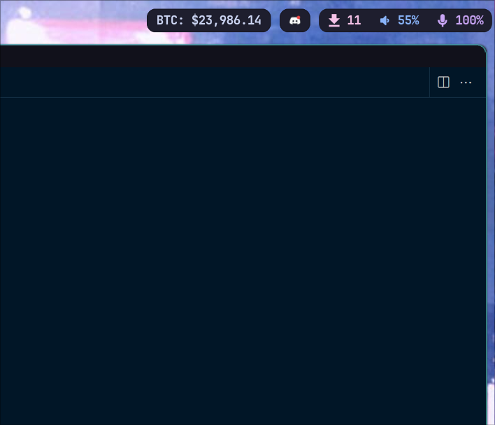

# Cryptocurrency Price Tracker

[](https://aur.archlinux.org/packages/crypto-tracker/)



This is a simple script written in Go to retrieve the latest price for several cryptocurrencies using the CoinMarketCap API. The script takes in various command line flags, including the CoinMarketCap API key, the main symbol to display, and the symbols to track. The default symbols tracked are BTC, DOT, BNB, ETH, and FLOW.

It emits a JSON object that you can use in your own scripts or in a status bar like Waybar.

## Flags

The following command line flags are available for use in this script:

- -m, --mainsymbol: The main symbol to display. If not provided, the default value of "BTC" is used.
- -k, --key: Your CoinMarketCap API key. This flag is required.
- -s, --symbols: A comma-separated list of symbols to track. If not provided, the default symbols of BTC, DOT, BNB, ETH, and FLOW are used.

## Install

You can find this packge on the [AUR](https://aur.archlinux.org/packages/crypto-tracker).

## Waybar Example

This is how you'd use it as a custom module in [Waybar](https://github.com/Alexays/Waybar).

```
//config
"custom/cryptotracking": {
    "format": "{}",
    "return-type": "json",
    "exec": "crypto-tracker -k XXXXXXXXX -s BTC,ETH,DOGE -m BTC",
    "restart-interval": 600
}

//style
#custom-cryptotracking {
  background: #98bb6c;
  color: #1f1f28;
  padding: 0 10px;
  margin-right: 10px;
  opacity: 1;
  transition-property: opacity;
  transition-duration: 0.25s;
}

```
